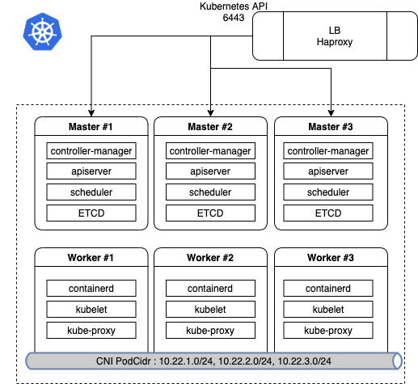

# Prerequisites


## Hardway System Requirement

### Hardway Tutorial System

본 튜토리얼은 master 3 대, worker 3 대로 구성합니다.

[Terraform Tutorial of rhev](https://github.com/nationminu/terraform-ovirt-k8s)

| Hostname      | CPU           | Memory  |
| ------------- |:-------------:| -------:|
| master1       | 2 core        |    4G   |
| master2       | 2 core        |    4G   |
| master3       | 2 core        |    4G   |
| worker1       | 2 core        |    4G   |
| worker2       | 2 core        |    4G   |
| worker3       | 2 core        |    4G   |

### Hardway Tutorial Topology


## Configuration for k8s Hardway
```
tasks: 
    - name: "Set up environment varibles"
      set_fact: 
        # Variables for KUBERNETES Hardway
        # external varibles : ansible-playbook -i inventory.ini -e @hardway.json hardway.yaml
        KUBERNETS_CLUSTER_NAME: rockplace-k8s-the-hard-way
        KUBERNETES_DIRECTORY: "/etc/kubernetes"
        KUBERNETES_PUBLIC_ADDRESS: "10.65.40.10" # LB(Haproxy) IP
        KUBERNETES_HOSTNAMES: "kubernetes,kubernetes.default,kubernetes.default.svc,kubernetes.default.svc.cluster,kubernetes.svc.cluster.local"
        KUBERNETES_BINARY_PATH: "/usr/local/bin"
        KUBERNETES_FQDN: "example.com"
        KUBERNETES_VERSION: v1.18.8
        KUBERNETES_RUNTIME: "containerd"

        ETCD_VER: "v3.4.13"
        CRI_VER: "v1.18.0"
        CNI_VER: "v0.8.7"
        CONTAINERD_VER: "1.4.0"
        RUNC_VER: "v1.0.0-rc92"
        POD_CIDR: "10.22.0.0/16" # not used
        POD_CIDR_PREFIX: "10.22" # .1.0/24 : worker1, .2.0/24 : worker2, .2.0/24 : worker3, 
        CRIO_VER: "1.18"

        TLS_CN: "Kubernetes"
        TLS_C: "KR"
        TLS_L: "SEOUL"
        TLS_OU: "rockPLACE PST"
        TLS_O: "rockPLACE"
        TLS_ST: "SEOUL"
      no_log: true
```

## Provide a bash completion on host name
```
- hosts: all 
  any_errors_fatal: "{{ any_errors_fatal | default(true) }}"
  gather_facts: False  
  roles:
    - { role: prerequisites/ssh-config }
```
### ansible task
```
---
- name: create ssh config
  become: true
  template:
    src: ssh_config.j2
    dest: /etc/ssh/ssh_config
    mode: 0644

- name: create bash_completion_ssh
  become: true
  copy:
    src: bash_completion_ssh
    dest: /etc/bash_completion.d/ssh
    mode: u+x,g+x,o+x

- name: apply bash_completion_ssh
  become: true
  shell: |
    echo 'source /etc/bash_completion.d/ssh' > /etc/profile.d/ssh_completion.sh
    chmod +x /etc/profile.d/ssh_completion.sh
```
### ssh_config.j2 jinja template
```
## ssh config for k8s cluster


## {{ loop.index }} {{ hostvars[host]['inventory_hostname'] }}
Host {{ hostvars[host]['inventory_hostname'] }} {{ hostvars[host]['inventory_hostname'] }}.{{ KUBERNETES_FQDN }}
  HostName {{ hostvars[host]['ansible_host'] }}
  User {{ ansible_user }}
  
  IdentityFile /{{ ansible_user }}/.ssh/id_rsa
  
  IdentityFile /home/{{ ansible_user }}/.ssh/id_rsa
  
  StrictHostKeyChecking no
  UserKnownHostsFile=/dev/null


```
## ssh bash_competion file
```
_ssh()
{
    local cur prev opts
    COMPREPLY=()
    cur="${COMP_WORDS[COMP_CWORD]}"
    prev="${COMP_WORDS[COMP_CWORD-1]}"
    opts=$(grep '^Host' /etc/ssh/ssh_config  ~/.ssh/config ~/.ssh/config.d/* 2>/dev/null | grep -v '[?*]' | cut -d ' ' -f 2-)

    COMPREPLY=( $(compgen -W "$opts" -- ${cur}) )
    return 0
}
complete -F _ssh ssh

``` 

## The configuration requirements for k8s
```
- hosts: all
  any_errors_fatal: "{{ any_errors_fatal | default(true) }}"
  gather_facts: False  
  roles: 
    - { role: prerequisites/pre-config } 
```

### ansible tasks
* /etc/hosts
* swapoff
* iptables
* firewalld
* selinux
* essential package
```
---
# tasks file for prerequisites/pre-config  
- name: Add Hostname to /etc/hosts 
  copy:
    dest: "/etc/hosts" 
    content: |
      127.0.0.1   localhost localhost.localdomain localhost4 localhost4.localdomain4
      ::1         localhost localhost.localdomain localhost6 localhost6.localdomain6

      # {{ KUBERNETES_FQDN }} Cluster
      
      {{ hostvars[host]['ansible_host'] }}  {{ hostname[0] }} {{ hostvars[host]['inventory_hostname']}} {{ hostname[0] }}.my.internal
      
 
- name: Disable swapoff
  shell: |
    swapoff -a  

- name: Disable swapoff permanently
  replace:
    path: /etc/fstab
    regexp: '^(\s*)([^#\n]+\s+)(\w+\s+)swap(\s+.*)$'
    replace: '#\1\2\3swap\4'
    backup: yes
    
- name: modprobe br_netfilter
  modprobe:
    name: br_netfilter
    state: present 

- name: Update Iptables Settings (1/2)
  copy:
    dest: /etc/sysctl.d/k8s.conf
    content: |
      net.bridge.bridge-nf-call-ip6tables = 1
      net.bridge.bridge-nf-call-iptables = 1 
      net.ipv4.ip_forward=1

- name: Update Iptables Settings (2/2)
  shell: | 
    sysctl --system

- name: Disabled selinux
  shell: |
    setenforce 0
    sudo sed -i 's/^SELINUX=enforcing$/SELINUX=permissive/' /etc/selinux/config 

- name: Disabled firewalld 
  systemd:
    name: firewalld
    state: stopped
    enabled: false     

- name: Install package for k8s
  yum:
    name: "{{ item }}"
    state: installed
  with_items:
    - wget
    - rsync
    - systemd-resolved 
    - dnsmasq
    - socat
    - conntrack 
    - ipset

- name: start package for k8s
  systemd:
    name: "{{ item }}"
    state: started
    enabled: yes
    daemon_reload: yes
  with_items: 
    - systemd-resolved 
...

```

## Install HAProxy on Centos/Red Hat with Ansible

```
- hosts: jumpbox
  any_errors_fatal: "{{ any_errors_fatal | default(true) }}"
  gather_facts: False  
  roles:
    - { role: install-tools/haproxy } 
```

### ansible tasks
```
---
# tasks file for install-tools/haproxy
- name: Install Haproxy for LB
  yum:
    name: "{{ item }}"
    state: installed
  with_items:
    - haproxy

- name: Configure Haproxy
  template:
    src: "haproxy.cfg.j2"
    dest: "/etc/haproxy/haproxy.cfg"

- name: start Haproxy for LB
  systemd:
    name: "{{ item }}"
    state: started
    enabled: yes
    daemon_reload: yes
  with_items: 
    - haproxy
```

### Configuration haproxy of jinja template
```
# Global settings
#---------------------------------------------------------------------
global
    maxconn     20000
    log         /dev/log local0 info
    chroot      /var/lib/haproxy
    pidfile     /var/run/haproxy.pid
    user        haproxy
    group       haproxy
    daemon
    # turn on stats unix socket
    stats socket /var/lib/haproxy/stats
#---------------------------------------------------------------------
# common defaults that all the 'listen' and 'backend' sections will
# use if not designated in their block
#---------------------------------------------------------------------
defaults
    mode                    http
    log                     global
    option                  httplog
    option                  dontlognull
#    option http-server-close
    option forwardfor       except 127.0.0.0/8
    option                  redispatch
    retries                 3
    timeout http-request    10s
    timeout queue           1m
    timeout connect         10s
    timeout client          300s
    timeout server          300s
    timeout http-keep-alive 10s
    timeout check           10s
    maxconn                 20000
    
listen stats :9000
    mode http
    stats enable
    stats uri /
  
# api
frontend  k8s-apiserver
    bind  :6443
    mode tcp
    option tcplog
    default_backend k8s-master
  
# api
backend k8s-apiserver
    balance source
    mode tcp 

    server {{ groups['kube-master'][0] }} {{ hostvars[groups['kube-master'][0]].ansible_host }}:6443
    server {{ groups['kube-master'][1] }} {{ hostvars[groups['kube-master'][1]].ansible_host }}:6443
    server {{ groups['kube-master'][2] }} {{ hostvars[groups['kube-master'][2]].ansible_host }}:6443

    server {{ hostvars[groups['kube-master'][0]].ansible_host }}:6443

```